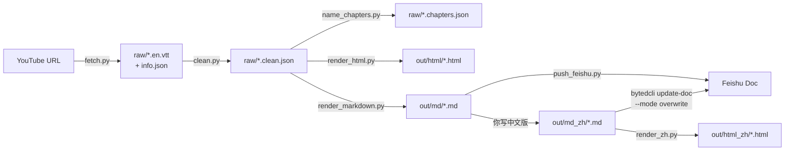
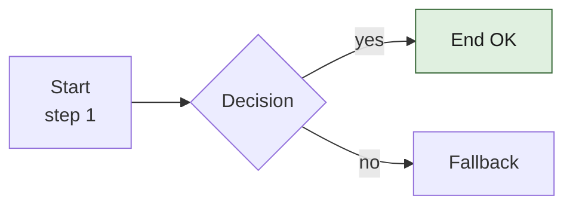

# yt-to-doc

Convert YouTube tech talks → Feishu Cloud Doc + standalone HTML, with optional Chinese restructured version.

## When to invoke this skill

Trigger conditions (any of):

- User shares a YouTube URL and asks for a Feishu doc / Cloud Doc / 飞书文档
- User asks to translate an existing English transcript into a Chinese version
- User wants HTML pages of YouTube tech talks for GitHub Pages / internal site
- User mentions `urls.txt`, `out/md/`, `out/md_zh/`, or `feishu_urls.json` in their working dir

## Prerequisites

| Tool | Why needed | How to check |
|---|---|---|
| `yt-dlp` | fetch YouTube subtitles + metadata | `python -c "import yt_dlp"` |
| `bytedcli` | push markdown to Feishu via MCP bridge | `bytedcli --version` |
| `ANTHROPIC_API_KEY` | only if running `name_chapters.py` batch path | env var present |
| `youtube_cookies.txt` (optional) | only when YouTube bot-checks the runner IP — Netscape-format cookies at project root | file exists |

Python deps: `pip install -r requirements.txt`.

## Project layout when the skill runs

```
<workdir>/
├── urls.txt              # one YouTube URL per line
├── raw/                  # yt-dlp output: <vid>.en.vtt, <vid>.info.json, <vid>.clean.json, <vid>.chapters.json
├── out/
│   ├── html/             # English HTML
│   ├── html_zh/          # Chinese HTML
│   ├── md/               # English markdown (mirror of Feishu doc body)
│   ├── md_zh/            # Chinese restructured markdown — YOU WRITE THESE
│   ├── feishu_urls.json  # doc_id ↔ video_id index, auto-updated on push
│   └── feishu_urls.txt   # human-readable URL list
└── youtube_cookies.txt   # optional
```

## Pipeline overview



## Standard workflows

### A) English transcript → Feishu doc + HTML (one-shot)

```bash
python run.py --url https://www.youtube.com/watch?v=VID --target both
# or batch:
python run.py --urls-file urls.txt --target both --concurrency 3
```

`run.py` is idempotent: it skips videos that already have an HTML output (or
Feishu entry in `feishu_urls.json`) unless `--force` / `--force-feishu` is set.

`--target` accepts `html | feishu | both` (defaults to `html`). `--force` only
re-renders HTML; `--force-feishu` will CREATE A DUPLICATE Feishu doc — only
use it after manually deleting the old one.

### B) Restructure an English transcript into a Chinese version

The English md exists at `out/md/<vid>.md`. You're going to:

1. **Read** the English md end-to-end.
2. **Write** a Chinese restructured version into `out/md_zh/<vid>.md`.
3. **Render** the Chinese HTML: `python -m pipeline.render_zh <vid>` (writes
   `out/html_zh/<vid>.html`).
4. **Overwrite** the existing Feishu doc (look up doc_id from
   `out/feishu_urls.json`):
   ```bash
   bytedcli --json feishu docs update-doc \
     --doc-id <doc_id> \
     --markdown-file out/md_zh/<vid>.md \
     --mode overwrite
   ```

If the overwrite response says `"status":"running"` with a `task_id`, poll it:
```bash
bytedcli --json feishu docs update-doc --task-id <task_id>
```

## How to write the Chinese version — STYLE GUIDE

This is the part where you (Claude) do creative work. The English md is a
nearly-literal transcript split into chapters with timestamps. The Chinese
version is **NOT a literal translation** — it's a reorganized, summarized,
visualized rewrite. Treat it like writing a tech blog post from the
transcript.

### Required structure

```markdown
# <中文标题>

> 作者：**<姓名>**（<所属/角色>） · 演讲场合：<场合> · 时长：约 N 分钟 · [▶ 原视频](https://www.youtube.com/watch?v=<VID>)

> **本文是中文整理版**：在视频内容的基础上重新组织、补图表，方便快速阅读。关键节点附 YouTube 时间戳链接，可点击跳回原视频对应位置核对。

---

## 一、<章节标题>

正文…在关键处穿插时间戳链接 [N:NN](https://www.youtube.com/watch?v=<VID>&t=<sec>s)

...

---

_本文基于 YouTube 自动字幕 + 人工章节整理 + 中文重新组织。时间戳链接点击可跳回 YouTube 对应位置核对原话。_
```

### Reorganization principles

- **Don't translate paragraph-by-paragraph.** Re-extract the talk's argument structure and use that as the new outline.
- **Use `##` for major sections** (one set of `##` per topical idea — usually 6–10 sections), `###` for sub-points inside a section.
- **Add at least 2–4 mermaid diagrams** that visualize architecture, decision flows, or before/after states. Each diagram gets a "图 N：…" caption right below.
- **Add tables for any "compare 2+ options" or "checklist" content.**
- **Preserve timestamp links** at the moments where claims/data come from the talk. Format: `[M:SS](https://www.youtube.com/watch?v=<VID>&t=<sec>s)` — convert M:SS to seconds.
- **End with a one-liner takeaway** marked as `> "..."` blockquote, and a "一句话外带" header before it.
- **Use plain Chinese**, not literal translation. Idioms, comparisons, and explanations should read like a Chinese tech blog, not a transcript dump.

See `examples/example_zh.md` for a reference (this is the `mWvtOHlZM-I.md`
Chinese version — the StockPilot agent decomposition talk).

### Feishu mermaid syntax bans — **critical to avoid**

`bytedcli ... --mode overwrite` reports `success=true` but **boards can fail
silently** (BOARD_WRITE_FAILED) if mermaid syntax trips Feishu's renderer.
Avoid these:

| Forbidden | Why | Use instead |
|---|---|---|
| `rect rgb(...)` in flowchart | unsupported | `classDef ...` + `class A,B foo` |
| Parentheses inside `<br/>` inside node labels: `[label<br/>(detail)]` | parse-fail | drop the parens or move detail outside |
| Double-quote `"` inside `[node]` brackets: `[say "hi"]` | parse-fail | use `'` or rephrase |
| Semicolons inside `sequenceDiagram` | parse-fail | split into separate lines |

Mermaid examples that ARE safe in Feishu:



After overwrite, **always remind the user to visually scan the Feishu doc** for
empty mermaid boards — silent failures only show as missing diagrams.

## Common one-off operations

### Add a new YouTube URL to an existing pipeline

1. Append URL to `urls.txt`
2. `python run.py --urls-file urls.txt --target both` (idempotent — skips done ones)

### Force a re-render after editing chapters.json by hand

```bash
python run.py --url https://youtu.be/VID --force
```

### Render only the index page

`run.py` rebuilds `out/html/index.html` automatically whenever it renders any
HTML in the same batch. To rebuild just the index without re-rendering talks,
re-run with `--force` against a single URL.

### Update an existing Feishu doc with a Chinese version

Look up the doc_id:
```bash
python -c "import json; print(json.load(open('out/feishu_urls.json'))['VID']['doc_id'])"
```

Then overwrite (see "Standard workflows B" above).

## Edge cases & gotchas

- **`name_chapters.py` is optional.** If you have no `chapters.json`, the
  HTML renderer falls back to "N paragraphs per chapter" auto-grouping. For
  Feishu push, however, `run.py` REQUIRES a chapters.json — either run the
  Claude-based batch script with `ANTHROPIC_API_KEY` set, or hand-write the
  JSON.
- **Auto-subtitles only.** `fetch.py` heuristically detects whether YouTube
  provided manual or auto subs; auto subs are all lowercase and unpunctuated
  — `clean.py`'s sentence splitter is tuned for that, but quality varies.
- **Rolling 2-line auto-sub format.** YouTube auto-subs use a rolling
  display format; `clean.py:_extract_new_line` handles dedup. If you see
  duplicated phrases in `out/md/`, that path may need tuning.
- **`--force-feishu` CREATES a duplicate doc.** Only use after deleting the
  old one manually. To replace content in place, use `bytedcli ... update-doc
  --mode overwrite` directly.
- **bytedcli MCP-bridge response.** The actual payload is JSON-encoded
  inside `data.response.content[0].text` — `push_feishu._extract_last_json`
  + a second `json.loads` handles this.

## Files in this skill

- `SKILL.md` — this file
- `README.md` — install + usage docs (human-facing)
- `requirements.txt` — Python deps
- `run.py` — orchestrator
- `pipeline/` — fetch / clean / name_chapters / render_html / render_markdown / render_zh / push_feishu
- `pipeline/templates/` — Jinja2 templates for English HTML
- `examples/example_zh.md` — reference Chinese restructured md (StockPilot talk)
