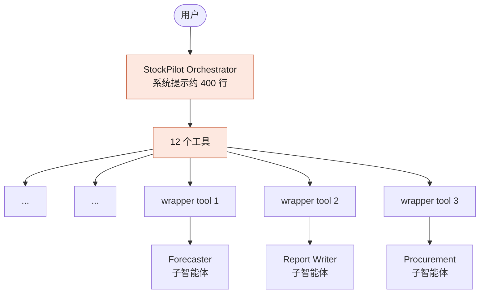
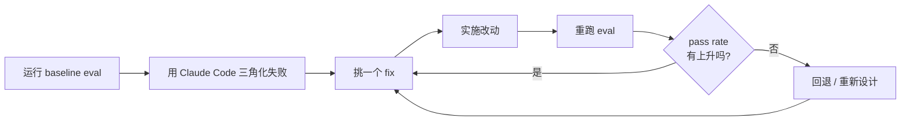
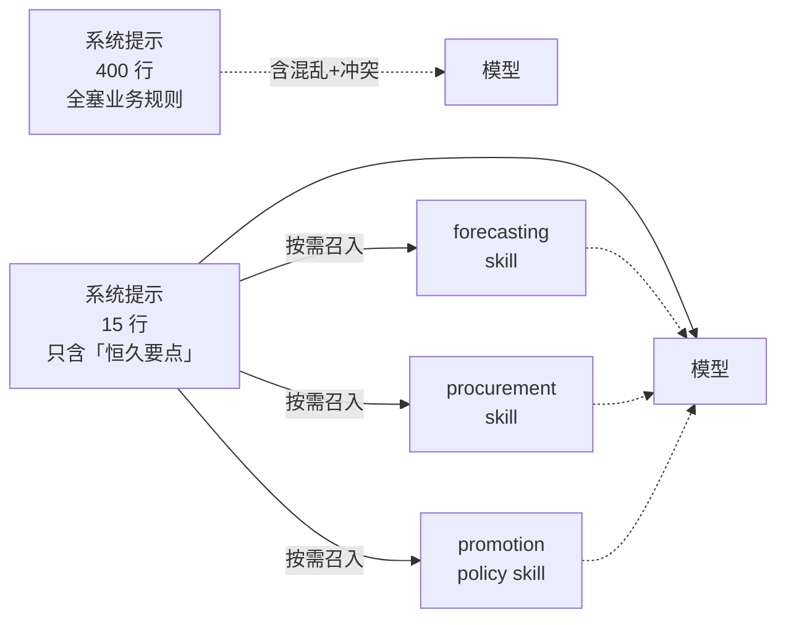
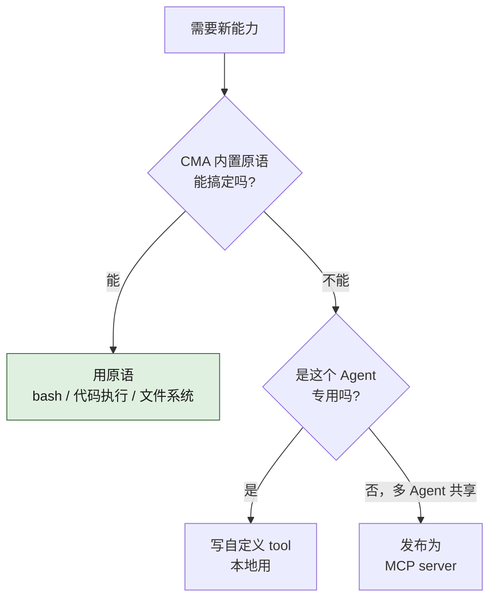
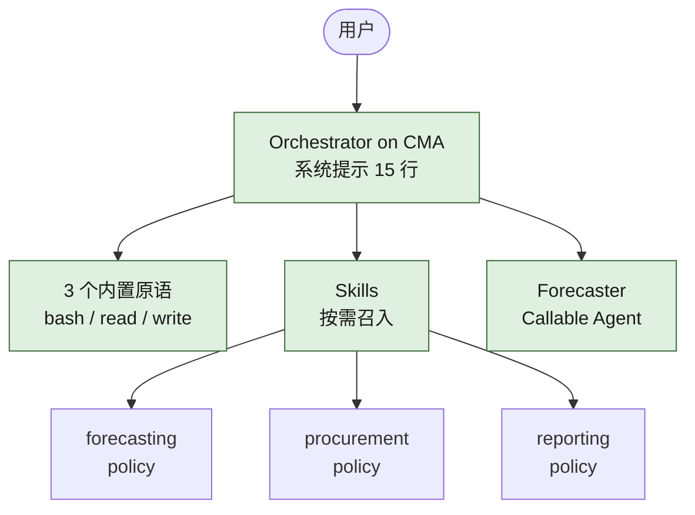

# 工具、技能还是子智能体？拆解一个过度膨胀的 Agent

> 作者：**Will**（Anthropic 应用 AI 团队） · 演讲场合：Code with Claude · London · 时长：45 分钟 · [▶ 原视频](https://www.youtube.com/watch?v=mWvtOHlZM-I)

> **本文是中文整理版**：在视频内容的基础上重新组织、补充图表，方便快速阅读。文中关键节点附 YouTube 时间戳链接，可点击跳到原视频对应位置核对。

---

## 一、问题：Agent 长着长着就崩了

你给业务上线了一个 Agent，第一版小巧、好用。两周后，业务方说："能不能再加点能力？"——你加上了。再过几周，又来一波需求，你又加。

如此反复，等你回头看时，发现：

- 系统提示（system prompt）已经膨胀到几百行；
- 工具数量翻倍，甚至嵌套了好几个子智能体；
- 而那些**原本表现很好的功能**，开始出现 regression（性能回归）。

Will 在演讲开头 [0:48](https://www.youtube.com/watch?v=mWvtOHlZM-I&t=48s) 强调：这是 Anthropic 在客户和自家内部都反复看到的模式——**把功能"粘"到现有 Agent 上是最快的路径，但也是最伤架构的路径**。

这次 workshop 的目标就是：拿一个真实变臃肿的 Agent，演示如何用**正确的 agentic primitive**（工具 / 技能 / 子智能体）把它拆回去，并通过 eval 验证每一步是不是真的有改进。

---

## 二、主角：StockPilot——一个 400 行系统提示的库存 Agent

StockPilot 是一个虚构的中型零售商内部的**库存管理 Agent**。它的能力（[3:00](https://www.youtube.com/watch?v=mWvtOHlZM-I&t=180s)）：

- 标记库存不足；
- 预测需求；
- 挑选供应商；
- 提交采购订单（PO）；
- 给员工生成周报。

每一项单独看都不复杂。问题在于**架构**：

**图 1：StockPilot 改造前的架构**——一个 orchestrator + 12 个工具 + 3 个被工具包装的子智能体，全部由一份膨胀的系统提示统筹。

每次新需求来，开发都倾向于"再加一个工具"或"再加一个子智能体"。久而久之就成了这副样子。Will 说他们见过非常多客户的系统都是这种结构（[4:10](https://www.youtube.com/watch?v=mWvtOHlZM-I&t=250s)）。

---

## 三、怎么知道它病了？评估体系

StockPilot 的评估套件有 **12 个 eval 任务**，分两类：

| 类别 | 前缀 | 性质 | 任务复杂度 |
|---|---|---|---|
| **回归测试** | `R*` | 单轮、相对简单 | 真实使用场景的代表 |
| **失败模式测试** | `F*` | 多轮、刻意构造 | 复杂、模拟极端情况 |

评估同时用两种 grader：

- **确定性指标**：token 使用量、延迟、turn 数；
- **非确定性指标**：用 LLM-as-judge 评估输出风格、语气、质量。

### 三个典型失败案例

Will 重点拆了三个会失败的 eval（[7:06](https://www.youtube.com/watch?v=mWvtOHlZM-I&t=426s) 起）：

| Eval | 模拟场景 | 失败根因 |
|---|---|---|
| **F1**：日常低库存扫描 | 给定库存数据，挑出告急 SKU | Agent 走了一条"绕远的路"——结果正确，但**路径过低效**，达不到效率阈值。 |
| **F2**：促销期采购流程 | 在促销包条件下下采购单 | **Orchestrator 与子智能体之间通信失真**——子智能体计算对了，但传回 orchestrator 时信息丢失。 |
| **R8**：促销月预测 | 计算某促销月的销售预测 | **系统提示里有两条互相矛盾的策略**，模型读到后混乱：拿到了正确的 baseline（12 units/day）和正确的 multiplier（3.1x），但**计算时用成了 1.35x**——上下文污染导致幻觉。 |

R8 是个典型的**"上下文问题不是模型问题"**——模型周围的信息有矛盾，再聪明的模型也会蒙。

---

## 四、工作法：在 Eval 上"爬坡"

整个 workshop 的方法论叫 **hill climbing**——每次只改一点，每次都回归 eval，看 pass rate 有没有真的往上爬。

**图 2：Eval 爬坡的工作流**——每改一次都用 eval 把改动锁住，避免靠"感觉"判断改进。

### Workshop 上手要点

- Repo 里有 `before/` 和 `starter/` 两个目录。`before` 是基于 Messages API 自建的 agent loop；`starter` 是同样的 agent 跑在 **Claude Managed Agents (CMA)** 上的版本（[10:50](https://www.youtube.com/watch?v=mWvtOHlZM-I&t=650s)）。
- 先 `uv run evals --agent before` 拿基线（理论 83%，实际 Will 现场跑出 62%）。
- 改造目标是把 agent 迁到 **CMA**：自己只关心 agent 设计，scaling / 内存 / 安全 / 沙箱这些都交给 CMA。

### 用 Claude Code 帮忙三角化

Will 现场打开 Claude Code（Opus 4.7，effort 调到 extra high），让 Claude 帮他诊断为啥 eval 跌到 62%（[17:13](https://www.youtube.com/watch?v=mWvtOHlZM-I&t=1033s)）。Claude 总结出几条主因：

1. 模型在做**本该用工具完成的推理**——没工具能调，只能硬算；
2. **输出结构没强约束**，子智能体回传的格式与 orchestrator 期望对不上；
3. **系统提示自相矛盾**（如 R8 的两条策略冲突）。

这一步关键不是诊断结论本身，而是用 Claude **从 eval 失败回推架构问题**的方法。

---

## 五、Fix #1：把系统提示压短，业务知识下沉为 Skill

**Skill** 是 Claude 可以在需要时**按需调入上下文**的"打包知识"。可以理解为：一份 markdown + 元数据，描述某领域知识或操作规程；Claude 判断当前任务相关就读，不相关就不读。

**图 3：从"全塞系统提示" → "渐进式披露（progressive disclosure）"**

### 关键原则（[20:30](https://www.youtube.com/watch?v=mWvtOHlZM-I&t=1230s) 起）

- **系统提示只留"Claude 无论做什么任务都必须知道"的内容**——身份、整体目标、安全约束。
- **业务规则、流程手册、品牌指南** → 全部下沉为 skill。
- 当 Claude 接到任务时，它自己判断需要哪些 skill 召入，不需要就不污染上下文。

### 效果

StockPilot 的系统提示从 **400 行压到 ~50 行**（后期最终版本进一步缩到 **15 行**）。业务知识完整保留，只是从"全量塞"改成"按需取"。

---

## 六、Fix #2：拒绝写一堆自定义工具，先用类人原语

Anthropic 内部和给客户做 Agent 时遵循一条原则：**先用类人原语，自定义工具留到最后**（[26:00](https://www.youtube.com/watch?v=mWvtOHlZM-I&t=1560s) 起）。

类人原语指的是：人类员工每天到工位上有什么，就给 Claude 什么——

| 原语 | 对应人类能力 | 在 Claude Code / CMA 里的体现 |
|---|---|---|
| **bash** | 在终端跑命令 | 执行任意 shell |
| **file system (read/write)** | 翻文件、写文件 | 读写沙箱内文件 |
| **代码执行** | 写脚本算东西 | Python / 其他语言 |
| **web search** | 浏览器查资料 | 内置搜索工具 |
| **TODO list** | 自己列待办 | 内置 to-do 跟踪 |

**Claude Code 之所以强，不是因为它特别会写代码，而是因为它拥有人类工程师在岗一天能用到的全部基础工具**（[26:30](https://www.youtube.com/watch?v=mWvtOHlZM-I&t=1590s)）。每次模型升级，这套原语会自然变得更厉害——就像同一个人多读了几本书后，用同一台电脑也能产出更多。

### 决策矩阵

| 选项 | 何时优先 | 何时不用 | 例子 |
|---|---|---|---|
| **CMA 内置原语**（bash / 文件系统 / 代码执行 / web search） | 任务可以用"通用计算"解决；想要随模型升级自然变强 | 几乎没有"不用"的场景，先用了再说 | 用 bash 跑 Python 处理 CSV，比把 CSV 全塞进上下文便宜得多 |
| **自定义 tool** | 上面原语不够，要接特定 API / SDK / 内部系统 | 能用代码执行直接调 CLI/API 时 | 调内部审批系统、专用算法 |
| **MCP server** | 多个 Agent / 多个 Claude Code 实例**共享同一套受治理的工具** | 单 Agent 自用、临时需要 | 公司级的工具中心 |

### 实操：StockPilot 的工具大瘦身

StockPilot 原有 12 个自定义工具，大部分是"读数据"、"分析数据"、"写报表"——这些都可以用 **bash + 代码执行**统一替代。

Will 让 Claude 重构后，工具数从 12 → **3**（bash + read + write）。其余能力交给代码执行（[29:15](https://www.youtube.com/watch?v=mWvtOHlZM-I&t=1755s)）。

### 立竿见影的指标改善

| 指标 | 改造前 | 改造后（仅完成 Fix #1+#2 时） | 改进 |
|---|---|---|---|
| 单任务 token 用量 | > 200,000 | 大幅下降 | 因为用代码"按需取数据"而非把 CSV 整个塞进上下文 |
| 单任务费用 | 高 | 显著下降 | token 减少的直接结果 |
| 执行延迟 | — | 下降 | 简化工具 + 减少 turn |

---

## 七、MCP 的位置：能不上就不上

很多客户的现状是：**先冲去搞 MCP**，结果一堆零散、能力重叠的 MCP server 跑在系统里，反而把上下文搞乱（[31:31](https://www.youtube.com/watch?v=mWvtOHlZM-I&t=1891s)）。

**图 4：工具引入决策**——MCP 不是首选，是**多 Agent 共享治理**才该上的最后一档。

另外，**代码执行也能直接调 CLI/API**——很多本来想用 MCP 解决的能力，让 Claude 直接写代码调外部接口，反而更灵活、更省上下文（[32:31](https://www.youtube.com/watch?v=mWvtOHlZM-I&t=1951s)）。

---

## 八、Fix #3：子智能体——什么情况下值得保留？

StockPilot 原有 3 个子智能体（forecaster / report writer / procurement）。改造后只**保留 forecaster**，其他全部去掉。判断依据：

### 子智能体的两个合理用例

| 用例 | 说明 | 例子 |
|---|---|---|
| **并行性**：把一份大问题拆给多个 Claude 同时啃 | 单 Claude 顺序做太慢；任务可并发 | 跨大代码库探索、deep research、多源 web search |
| **新鲜视角**：需要一个不带先前上下文的 Claude 来评审 / 处理 | 同一份上下文里的 Claude 容易自洽地走偏 | code review、写代码 + 评审分离 |

### StockPilot 保留 forecaster 的理由

预测模块属于第二种用例——主 Claude 在和用户对话过程中积累了大量上下文，**如果让同一个 Claude 同时写预测会被对话历史污染**。所以独立一个 forecaster sub-agent，干净的上下文里跑预测，结果回主 Claude（[37:51](https://www.youtube.com/watch?v=mWvtOHlZM-I&t=2271s)）。

### CMA 的原生 sub-agent 能力（Callable Agents）

CMA 原生支持把 sub-agent 注册为一等公民（不是"工具包装"），好处：

- **可观测性**：每个 sub-agent 的 transcript、token、turn 数自动归到 session 元信息里；
- **通信契约**：orchestrator ↔ sub-agent 的 message schema 更规范，不容易"传话失真"（前面 F2 失败的根因之一）；
- **调试简单**：不用自己跨 agent 拼日志。

所以 StockPilot 最终版把 forecaster 从"工具包装"改成 **callable agent**。

### 一个反直觉的趋势

随着前沿模型（如 Claude 4.x）变得更聪明，**主 Agent 能管的复杂度变大了**——很多过去拆给子智能体做的事，现在让主 Agent 自己做反而更好。Will 说他们看到的趋势是：**客户在主动减少 sub-agent 数量**，把能力收回到 orchestrator（[40:50](https://www.youtube.com/watch?v=mWvtOHlZM-I&t=2440s)）。

---

## 九、改造结果：从 62% → 92%

**图 5：StockPilot 改造后的架构**——orchestrator 部署在 CMA 上，3 个内置原语 + skills 渐进式披露 + 1 个保留的 callable agent。

### 改造前后对比

| 维度 | 改造前 | 改造后 |
|---|---|---|
| 部署 | Messages API 自建 agent loop | Claude Managed Agents（CMA） |
| 系统提示 | ~400 行（业务规则塞满） | **~15 行**（只留恒久要点） |
| 工具数量 | 12 个（含 3 个 sub-agent 工具包装） | **3 个**（bash / read / write） |
| 业务知识载体 | 系统提示 | **Skills**（progressive disclosure） |
| 子智能体 | 3 个，工具包装 | **1 个**（forecaster），CMA callable agent |
| Eval pass rate | 62%（Will 现场基线） | **92%** |
| 单任务 token | > 200,000 | 显著下降 |
| 单任务成本 | 高 | 显著下降 |

### 注意 trade-off

不是所有指标都"全胜"：

- **Turn 数**没明显减少——但因为 token 单价下来了，turn 数本身就不那么敏感；
- **延迟**在某些 forecasting 类高密度任务上没怎么降，**但这是值得付的代价**——准确性和成本是主线，延迟是副线。

---

## 十、工作总结

Will 给的三条 takeaway（[43:36](https://www.youtube.com/watch?v=mWvtOHlZM-I&t=2616s)）：

### 1. 起步永远是「单 Agent + 类人原语」

不要一上来就堆子智能体或 MCP。先给 Claude 一台"电脑"——bash、文件系统、代码执行、web search、TODO list——能解决就解决。

### 2. 用 Skill 做渐进式披露

业务知识、流程规范、品牌指南——**不要塞进系统提示**。打包成 skill，Claude 自己判断什么时候调入。

好处：上下文不被污染、Claude 在不需要的时候不知道这些规则反而决策更自由。

### 3. 用 Eval"爬坡"，不要靠感觉

任何一次架构改动都要落到一个能量化的 eval 上：

- **没在 eval 上验证的改动不算改进**——可能在你没盯到的角落引入了 regression；
- **eval 要覆盖你真正关心的事**（准确性 / 成本 / 延迟 / 用户体验维度，按重要性都要有）；
- 改 → 跑 eval → 看分数 → 决定下一步 → 改……持续 hill climbing。

---

## 附：相关概念速查

| 概念 | 一句话定义 | 何时引入 |
|---|---|---|
| **Tool** | 给 Agent 暴露一个特定 API/能力 | 内置原语 + 代码执行解决不了时 |
| **Skill** | 按需召入的领域知识/规程包 | 知识只在某些任务里需要时 |
| **Sub-agent** | 独立上下文的二级 Claude | 需要并行 / 需要新鲜视角时 |
| **Claude Managed Agents (CMA)** | Anthropic 托管的 Agent 运行环境，自带 scaling / 沙箱 / observability | 要上生产、不想自己维护 agent harness 时 |
| **Hill climbing** | 改一点 → 跑 eval → 看是否真改进 → 决定下一步的迭代方法 | 任何 Agent 优化流程 |
| **Progressive disclosure** | 信息按需暴露而非全量塞入，对应 Skill 的设计哲学 | 系统提示开始超过 50 行时 |

---

_本文基于 YouTube 自动字幕 + 人工章节整理 + 中文重新组织。时间戳链接点击可跳到 YouTube 对应位置核对原话。_
